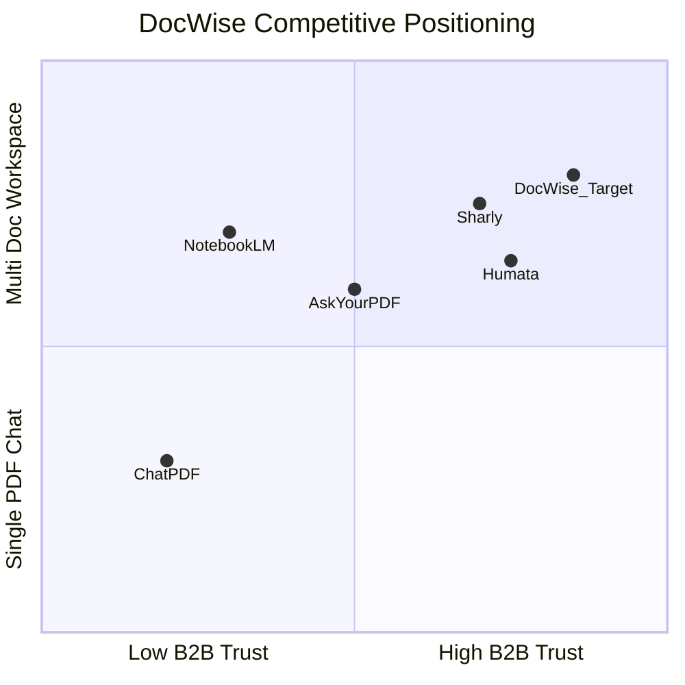
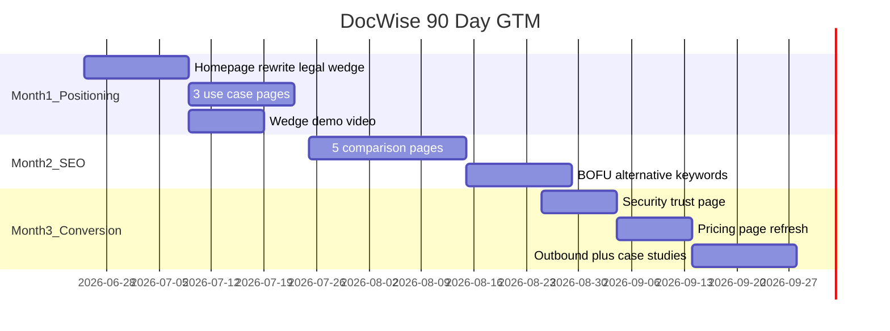
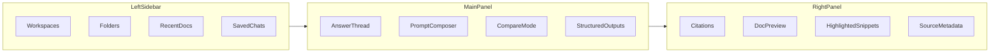

# DocWise Strategic Plan

_Last updated: 2026-06-25_

> Founder-grade strategy document synthesizing competitive battlecards, market research (V3), and premium SaaS design direction.  
> Use for **positioning, product roadmap, design system, pricing, and GTM execution**.

**Source documents merged into this plan:**
- `docwise_competitor_battlecard.md`
- `docwise_competitor_battlecard_v2.md`
- `docwise_v3_full_market_research_pack.md`
- `docwise_v3_full_market_research_pack_with_design.md`

**Related engineering docs:** [TASK.md](TASK.md) (day-by-day build plan), [PROJECT_SUMMARY.md](PROJECT_SUMMARY.md), [dev/deployment_plan.md](dev/deployment_plan.md)

---

## 1. Executive Summary

### Category shift

DocWise is **not** competing as "another chat with PDF" tool. The target category is:

**AI document intelligence / secure multi-document AI workspace for teams**

### One-line positioning (locked)

> **DocWise = secure multi-document AI workspace for teams and research-heavy professionals who need grounded answers, citations, and control across large document libraries.**

### Primary wedge (decision)

| Priority | ICP | Pitch |
|----------|-----|-------|
| **Primary** | Legal / compliance / internal knowledge teams | Cited answers across contracts, policies, SOPs with audit trails |
| **Secondary** | Research / analyst teams | Interactive knowledge base across reports and papers |

### Biggest strategic risk

**Generic positioning.** If the homepage leads with "chat with PDFs," DocWise looks interchangeable with ChatPDF, AskYourPDF, and free NotebookLM — wasting the B2B architecture already built (admin, audit, RBAC, billing, multi-tenant).

### Messaging to retire

- "Chat with PDF"
- "AI assistant for documents" (as hero copy)
- "NotebookLM but paid"

### Messaging to lead with

- Grounded answers across your document library
- Secure team workspaces with admin controls
- Cited answers for contracts, policies, reports, and research
- Document intelligence for serious work

---

## 2. Competitive Landscape

### Four market buckets

**A. Direct document AI competitors**
Humata, AskYourPDF, PDF.ai, ChatPDF, Sharly AI, ChatDOC, LightPDF, Smallpdf AI, UPDF

**B. Research / academic alternatives**
NotebookLM, Unriddle, SciSpace, Elicit, Paperguide, Mindgrasp

**C. General AI substitutes**
ChatGPT file uploads, Claude Projects, Gemini, Perplexity

**D. Enterprise adjacent**
Adobe Acrobat AI, Glean, Denser, Docsumo, Rossum, self-hosted RAG (LlamaIndex)

### Weekly watchlist (10)

Track these competitors weekly:

1. Humata — closest B2B/team benchmark
2. AskYourPDF — feature breadth + OCR + ecosystem
3. PDF.ai — monetization + API packaging
4. ChatPDF — onboarding UX benchmark
5. NotebookLM — free expectation setter
6. Sharly AI — research-team workspace benchmark
7. ChatDOC — table/data extraction reputation
8. SciSpace — academic credibility
9. Unriddle — research comprehension workflows
10. Adobe Acrobat AI — enterprise PDF-native threat

### Condensed competitor table

| Competitor | Audience | Core strength | Risk to DocWise |
|------------|----------|---------------|-----------------|
| Humata | Teams, businesses | B2B document chat + permissions | Out-positions if DocWise messaging stays vague |
| AskYourPDF | Power users | Feature breadth, OCR, extensions | Feature parity pressure |
| PDF.ai | Pros, devs | PDF utility + API | Strong commercial packaging |
| ChatPDF | Students, casual pros | Speed + simplicity | Sets minimum UX bar |
| NotebookLM | Researchers | Free grounded multi-source research | "Why pay for DocWise?" objection |
| Sharly AI | Research teams | Collaboration + citation workflows | Strong workspace benchmark |
| ChatDOC | General doc chat | Table/data understanding | Direct product comp |
| Unriddle | Researchers | Note-taking + understanding | Wins on thinking workflows |
| SciSpace | Academics | Paper understanding | Research authority |
| Adobe Acrobat AI | Business PDF users | PDF-native + brand trust | Enterprise incumbent |

### Positioning map

---

## 3. SWOT (validated against codebase)

### Strengths (built)

- Multi-document RAG chat with streaming and citations (`frontend/src/app/(dashboard)/chat/`)
- SaaS infrastructure: auth, RBAC, admin, audit logs, billing, usage limits
- Background ingestion (BullMQ), OCR, dead-letter queue + admin triage
- API keys with programmatic auth (`backend/src/middleware/auth.ts`)
- Account deletion, real storage tracking, admin analytics (recent MVP gap closure)
- Citation PDF highlight + token-based chunking + scanned PDF OCR (recent RAG improvements)

### Weaknesses (gaps)

- Landing page still generic PDF-chat messaging (`frontend/src/app/page.tsx`)
- No document comparison workflows
- No shared team workspaces / folders / collections
- No business output formats (briefings, compare tables, structured exports)
- Citation UX improving but not yet category-leading (Sharly citation history, NotebookLM outputs)
- PostgreSQL production migration on branch `feat/postgresql-production-db` (not yet on `main`)
- No public comparison pages or use-case landing pages
- Design: warm rust/cream theme — not yet premium enterprise indigo direction

### Opportunities

- Own "secure AI document workspace for teams"
- Specialize legal/compliance/policy/SOP workflows
- Win on citation UX + multi-document comparison
- Differentiate on trust, governance, and organization
- Bridge research workflows and business document workflows

### Threats

- **NotebookLM** — biggest free/low-cost expectation threat
- **Humata + Sharly** — can out-position for team/research workspaces
- **AskYourPDF** — can out-feature in breadth comparisons
- **ChatGPT / Claude / Gemini** — good-enough substitutes for casual use
- **Commoditization** — "upload and ask" alone is not a moat

---

## 4. Current State vs. Target State

| Area | Current state | Target state |
|------|---------------|--------------|
| **Positioning** | Generic "chat with documents" landing | Legal/compliance wedge + workspace framing |
| **Citation UX** | Page jump + highlight (partial) | Best-in-category: persistent panel, evidence blocks |
| **Compare docs** | Not built | 2+ doc compare with diff table + citations |
| **Workspaces** | Per-user document list | Folders, shared workspaces, permissions |
| **Outputs** | Chat markdown export | Briefings, compare tables, obligation extraction |
| **Onboarding** | Manual upload | Sample docs, <30s first answer, suggested prompts |
| **Database** | SQLite (dev) / Postgres branch | PostgreSQL production |
| **Pricing** | Free/Starter/Pro/Enterprise plans exist | Market-tuned $15–19 Pro, $29–39 Team |
| **GTM** | No comparison or use-case pages | 3 use-case + 5 comparison pages in 90 days |
| **Design** | Rust/cream warm theme | Premium B2B: indigo accent + 3-panel workspace shell |
| **Deploy** | Local dev | Railway + Vercel production |

---

## 5. Product Roadmap

### Phase A — Trust and differentiation (Weeks 1–4)

| Item | Status | Action |
|------|--------|--------|
| Citation UX (highlight, page jump, evidence panel) | Partial | Polish `PDFViewer`, add persistent right citation panel |
| Multi-document comparison | Not built | Compare 2+ docs: summary + diff table + per-diff citations |
| Fast onboarding (<30s first answer) | Partial | Sample docs, instant prompts after upload |

### Phase B — Workspace and governance (Weeks 5–8)

| Item | Status | Action |
|------|--------|--------|
| Folders / collections / shared workspaces | Not built | Workspace model + sharing + permissions |
| Source-only retrieval mode | Not built | RAG config flag per session (Sharly-style) |
| Document-level permissions | Not built | Extend RBAC to document scope |
| Export with citations | Partial | PDF/DOCX briefing export beyond chat markdown |

### Phase C — Business outputs (Weeks 9–12)

| Item | Action |
|------|--------|
| Briefing generator | Template prompts + structured output (NotebookLM benchmark) |
| Compare tables / obligation extraction | Legal ICP domain flows |
| Citation history / analytics | Per-workspace source usage (Sharly benchmark) |

### Phase D — Platform and GTM enablers (parallel)

| Item | Status | Action |
|------|--------|--------|
| PostgreSQL production DB | In progress | Merge `feat/postgresql-production-db`, deploy |
| Pricing tier alignment | Partial | Align limits to recommended tiers (Section 7) |
| Public API productization | Partial | Developer docs, rate limits, landing page |

### Phase E — Design system and UI evolution (Weeks 1–12, parallel Month 1 GTM)

| Item | Status | Action |
|------|--------|--------|
| Design tokens in Tailwind | Partial | Formalize indigo + neutral token set in `globals.css` |
| Homepage redesign (8 sections) | Generic | Legal wedge copy + workspace hero visual |
| 3-panel chat workspace | 2-panel + overlay | Refactor chat: sidebar / thread / citation panel |
| Citation-first answer cards | Basic | Evidence blocks + expandable sources |
| Compare mode UI | Not built | Visual compare workspace |
| Premium upload states | Basic | Parsing steps + suggested prompts on ready |
| Admin/settings polish | Functional | Stripe/Linear-quality settings patterns |

### Engineering already completed (do not re-plan)

- MVP gaps: account deletion, storage usage, API key auth, admin analytics
- RAG: citation highlighting, scanned PDF OCR, token-based chunking
- Infrastructure: BullMQ, audit logs, usage limits, NMI billing, eval suite

---

## 6. Pricing Strategy

**Do not compete on cheapest price.** NotebookLM and general AI tools make "cheap" a weak moat.

**Strategy:** Premium self-serve + team upgrade path.

| Plan | Recommended price | Limits |
|------|-------------------|--------|
| **Free** | $0 | 3–5 docs/mo, ~20 questions, 1 workspace, no team |
| **Pro / Solo** | $15–19/mo | Multi-doc, OCR, folders, higher limits |
| **Team** | $29–39/user/mo | Shared workspaces, RBAC, admin analytics, compare workflows |
| **Enterprise** | Custom | SSO, audit, SLA, DPA, custom deployment |

### Competitive anchors (verify live before publishing)

| Product | Entry paid | Team tier |
|---------|------------|-----------|
| Humata | $9.99/mo | $49/user/mo |
| Sharly AI | $12.5/mo | $24/user/mo |
| PDF.ai | $10/mo | $20–30/user/mo |
| AskYourPDF | $12–15/mo | Enterprise custom |

DocWise should sit **between Sharly and Humata** on team pricing if team features are real.

---

## 7. 90-Day GTM Roadmap

### Month 1 — Positioning + messaging

- [ ] Rewrite `frontend/src/app/page.tsx` for legal/compliance wedge
- [ ] Publish use-case pages: contract review, policy Q&A, research library assistant
- [ ] Record demo: "ask across 10 contracts with citations"
- [ ] Begin design token + homepage visual refresh (Phase E)

### Month 2 — Comparison + SEO

- [ ] DocWise vs ChatPDF, NotebookLM, Humata, AskYourPDF, PDF.ai
- [ ] BOFU pages: "NotebookLM alternative for legal teams", "best ChatPDF alternatives for teams"

### Month 3 — Conversion assets

- [ ] Security / governance page (audit, RBAC, data handling)
- [ ] Pricing page aligned to Team tier
- [ ] 2–3 outbound sequences for legal/research teams
- [ ] Onboarding email flow + case-study example outputs

---

## 8. Homepage and Messaging

### Hero (primary — legal / business)

**Headline:** Ask your contracts, policies, and reports anything — with citations you can trust.

**Subheadline:** DocWise turns document libraries into secure AI workspaces for teams. Ask questions across multiple documents, verify every answer with citations, and manage access with admin controls.

**CTAs:** Start free · Upload documents · Book demo

### Supporting bullets

- Grounded answers with source citations
- Ask across multiple documents at once
- Secure workspaces with access controls
- Usage visibility, quotas, and admin oversight
- Built for research, legal, and knowledge-heavy teams

### Homepage sections (8-section structure)

1. **Hero** — left copy, right workspace mockup (sidebar + answer + citation panel + multi-doc)
2. **Social proof / trust** — legal, research, knowledge teams
3. **How it works** — upload → ask across docs → verify with citations
4. **Core benefits** — citations, multi-doc, workspaces, compare, collaboration, admin
5. **Use cases** — contracts, policies, research, SOPs, due diligence
6. **Product proof** — answer + citations, compare, workspace, export
7. **Security / governance** — audit, permissions, data handling
8. **Pricing / CTA**

### Use-case pages to publish first

- Contract review assistant
- Policy & SOP Q&A assistant
- Research paper / report analysis assistant

---

## 9. SEO Content Strategy

### Cluster 1 — Competitor / alternative intent (BOFU)

- DocWise vs ChatPDF
- DocWise vs NotebookLM
- DocWise vs Humata
- DocWise vs AskYourPDF
- DocWise vs PDF.ai
- Best ChatPDF alternatives for teams
- NotebookLM alternative for legal teams
- Humata alternative with audit logs

### Cluster 2 — Use-case intent

- AI contract review assistant
- AI document Q&A for legal teams
- AI policy search across SOPs
- AI research library assistant
- AI due diligence document analysis
- AI assistant for internal knowledge bases

### Cluster 3 — Category education

- What is document intelligence?
- RAG for internal document search
- How to verify AI answers with citations
- Multi-document AI comparison workflows

### Cluster 4 — Feature-led pages

- Document comparison with citations
- OCR document chat
- Secure AI workspace for documents
- Admin controls for AI document tools

### Comparison page template

Every "DocWise vs X" page should include:

1. Hero — 1-line comparison + CTA
2. Quick comparison table (pricing, citations, multi-doc, OCR, team, admin, best for)
3. When to choose competitor (be fair)
4. When to choose DocWise (focus on wedge)
5. Feature-by-feature comparison
6. FAQ

---

## 10. Premium SaaS Design Direction

### Core design decision

> Build DocWise like a premium B2B AI workspace — **"Linear for document intelligence,"** not another ChatPDF clone.

### Design personality

| Trait | Meaning |
|-------|---------|
| **Precise** | Reliable, structured UI — not noisy |
| **Calm** | No loud colors, crowded dashboards, over-animated AI visuals |
| **Smart** | Intelligence workspace, not chatbot gimmick |
| **Premium** | Refined spacing, typography, surfaces — high-end B2B SaaS |

### Reference blend (study, do not copy)

**Marketing:** Linear, Vercel, Stripe, Attio, Notion  
**Product:** Linear, Notion, Perplexity, Glean, Dropbox Dash

### What NOT to look like

- ChatGPT wrapper landing pages
- Neon "AI startup" gradients everywhere
- Student-focused PDF tools
- Cluttered 2021-style dashboards
- Excessive badges, pills, and icons

### Color system

**Base neutrals**
- Background: warm white / soft off-white
- Surface: white + light neutral panels
- Text: deep charcoal / near-black
- Borders: soft gray

**Primary accent (recommended): deep indigo**
- Communicates trust, intelligence, professionalism
- Secondary: soft lavender-blue or cool steel blue
- Success: muted emerald · Warning: amber · Error: restrained red

**Brand evolution note:** Current app uses warm rust/cream tokens in `frontend/src/app/globals.css`. Moving to deep indigo is a **brand evolution decision** — evaluate whether to evolve gradually or rebrand in one pass alongside homepage rewrite.

### Typography

| Surface | Font | Rules |
|---------|------|-------|
| Marketing | Geist or Inter | Strong hierarchy, generous whitespace |
| Product app | Inter | Readable citation/answer cards, adequate line-height |

### Product app shell (3-panel layout)

**Current gap:** Chat is session-sidebar + thread + full-screen PDF overlay. Target is persistent right citation panel without context switching.

### Must-have premium UX patterns

| Pattern | Current | Target |
|---------|---------|--------|
| Citation-first answer cards | MessageBubble + SourceCard | Evidence block + expandable sources + confidence grouping |
| Source preview on click | PDFViewer overlay with highlight | Right panel always visible |
| Multi-document compare | Not built | Summary + differences table + per-diff citations |
| Workspace organization | Not built | Folders, pinned docs, tags, saved prompts |
| Premium upload flow | UploadZone basic | Parsing steps + suggested prompts on ready |

### Design system tokens (define early)

- **Spacing:** 4 / 8 / 12 / 16 / 24 / 32 / 48
- **Radius:** small (inputs), medium (cards), larger (marketing only)
- **Shadows:** subtle elevation only — no heavy blur
- **Type scale:** display, h1–h3, body, caption, mono for page refs
- **States:** hover, focus, active, selected, processing, disabled, error, success

### Motion

- Fast soft transitions (200–250ms)
- Skeleton loaders for answers and documents
- Stable streaming animation
- Avoid: sparkles, bouncing loaders, theatrical AI transitions

### Design differentiation priorities

1. Best citation interaction in the category
2. Beautiful compare-documents experience
3. Workspace-centric UI (not one-off chats)
4. Strong answer formatting (summary, bullets, evidence table, export-ready)
5. Premium admin/billing/settings area

---

## 11. Competitor Battle Quick-Reference

Use in sales calls, landing page copy, and comparison pages.

| Prospect says… | DocWise response angle |
|----------------|------------------------|
| **NotebookLM** | Team security, audit trails, internal docs, business workflows — not individual research |
| **Humata** | Cleaner UX, compare workflows, legal + research crossover, modern citation UX |
| **ChatPDF** | Team workspaces, governance, multi-doc at scale — not single-PDF utility |
| **AskYourPDF** | Focused quality over feature sprawl, B2B trust, opinionated business workflows |
| **PDF.ai** | Multi-document intelligence across team knowledge — not PDF-only utility |
| **Sharly** | Stronger legal/compliance wedge, enterprise trust story, business document focus |

### What to copy from each competitor

| Competitor | Learn from |
|------------|------------|
| ChatPDF | 30-second onboarding, side-by-side doc + chat |
| Humata | B2B landing page, permissions/security language, solo/team/enterprise tiers |
| AskYourPDF | OCR positioning, knowledge-base framing, power-user packaging |
| NotebookLM | Output formats beyond chat, workspace/notebook framing |
| PDF.ai | API packaging, clean pricing ladder |
| Sharly | Citation history, team collaboration, research-team framing |
| Unriddle | Thinking workflows, iterative research assistance |
| SciSpace | Domain-specific research credibility |

### What to avoid

- Competing primarily on "chat with PDF"
- Free-plan generosity as the main moat
- Generic "AI assistant for documents" copy
- Feature sprawl without a clear wedge
- Student-only messaging when architecture is business-ready

---

## 12. Success Metrics (90-day KPIs)

| Metric | Target |
|--------|--------|
| Time to first answer | < 30 seconds after upload |
| Landing page signup conversion | Baseline + improve after legal wedge rewrite |
| Free → Pro/Team conversion | Track monthly; target uplift after Team tier ships |
| Citation click-through rate | Measure in chat; target increase after 3-panel UI |
| Compare workflow adoption | Track once shipped |
| Citation panel engagement | Track after persistent right panel ships |
| Hero CTA click-through | Track after homepage redesign |

---

## 13. Investor-Style Market Summary (brief)

The "chat with PDF" market is maturing into **document intelligence / AI knowledge workspace**. The market is attractive because every organization has document overload and buyers increasingly want governance and traceability. It is hard because feature parity is easy to imitate, free tools compress pricing, and general-purpose AI is good enough for casual use.

**Where DocWise can win:** Combine trustworthy answers + team workflow + document organization + governance + use-case excellence — not "best PDF chatbot."

---

## 14. Top 5 Next Moves (priority order)

1. Rewrite homepage around legal / compliance / internal knowledge wedge
2. Ship best-in-class source citation UX (persistent panel + evidence blocks)
3. Build "compare documents" workflows
4. Publish DocWise vs NotebookLM / ChatPDF / Humata comparison pages
5. Add workspaces + permissions + exportable outputs as the visible core story

This moves DocWise from **"one more PDF AI tool"** to **"a serious document intelligence workspace for teams."**

---

## Appendix A — Design Brief (designer handoff)

> Design DocWise as a **premium AI document workspace for teams**, not a consumer PDF chatbot.  
> The product should feel **trustworthy, calm, precise, and expensive**.  
> Use a **neutral enterprise SaaS base** with a **deep indigo accent** (or evolve from current rust/cream deliberately).  
> Blend the clarity of **Linear**, the content calmness of **Notion**, and the polish of **Vercel/Stripe**.  
> Prioritize **citation UX, source visibility, multi-document comparison, and workspace organization**.  
> Keep the interface minimal, structured, and highly readable.  
> Avoid generic AI gradients and noisy dashboards.  
> Make the user feel they are using a serious intelligence system for important documents.

---

## Appendix B — Competitor URLs (verify live before external use)

### Official product pages

- ChatPDF — https://www.chatpdf.com/
- Humata — https://www.humata.ai/
- AskYourPDF — https://askyourpdf.com/
- NotebookLM — https://notebooklm.google.com/
- PDF.ai — https://pdf.ai/
- Sharly AI — https://sharly.ai/
- ChatDOC — https://chatdoc.com/
- Unriddle — https://www.unriddle.ai/
- SciSpace — https://scispace.com/
- Adobe Acrobat AI — https://www.adobe.com/acrobat/ai-assistant.html

### Pricing pages

- Humata — https://www.humata.ai/pricing
- AskYourPDF — https://askyourpdf.com/pricing
- PDF.ai — https://pdf.ai/pricing
- Sharly — https://sharly.ai/pricing
- NotebookLM limits — https://support.google.com/notebooklm/answer/16213268

> Pricing changes frequently. Re-check live pages and capture screenshots before publishing external comparisons.

---

## Appendix C — Comparison Page Headlines (draft)

| Page | Headline |
|------|----------|
| vs ChatPDF | ChatPDF is great for quick PDF Q&A. DocWise is built for teams that need cited answers across entire document libraries. |
| vs NotebookLM | NotebookLM helps individuals research sources. DocWise gives teams a secure AI workspace for documents. |
| vs Humata | Humata is a strong document chat platform. DocWise is designed for teams that need tighter workflows, grounded answers, and flexible workspaces. |
| vs AskYourPDF | AskYourPDF is feature-rich. DocWise focuses on trusted, team-ready document intelligence. |
| vs PDF.ai | PDF.ai is excellent for PDF workflows. DocWise is built for multi-document intelligence across team knowledge. |

---

*This plan is the strategic north star. For day-by-day engineering tasks, see [TASK.md](TASK.md). For deployment steps, see [dev/deployment_plan.md](dev/deployment_plan.md).*
