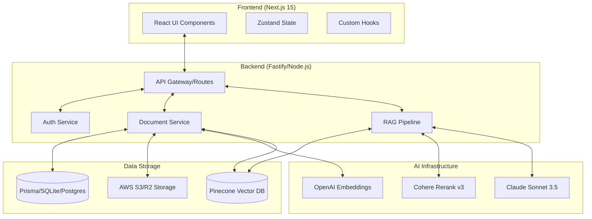

# DocWise — Project Overview & Technical Documentation

## 📑 Introduction
DocWise is an enterprise-grade AI-Powered Document Intelligence Platform designed to transform static documents into interactive knowledge bases. It leverages Retrieval-Augmented Generation (RAG) to provide precise, context-aware answers with verifiable source citations.

---

## 🏗️ System Architecture

### High-Level Design
DocWise follows a modern monorepo-friendly architecture with a clear separation between the client-side interface, the API orchestration layer, and specialized AI/Vector services.

---

## 👥 Target Audience
Who can benefit from DocWise?
- **⚖️ Legal Professionals**: Rapidly query contracts, case law, and discovery documents with precise citations.
- **🔬 Researchers & Academics**: Analyze hundreds of journals and papers simultaneously to find cross-referenced findings.
- **🏢 Corporate Teams (HR/Ops)**: Instant access to employee handbooks, SOPs, and internal policy documents.
- **🎓 Students**: Summarize and query textbooks and lecture notes for exam preparation.
- **🎧 Customer Support**: Use internal knowledge bases to provide instant, cited answers to complex customer queries.

---

## ✅ Advantages & ⚠️ Considerations

### Advantages
- **Unmatched Precision**: Uses Cohere Rerank v3 to ensure only the most relevant context reaches the LLM.
- **Verifiable Transparency**: Clickable citations link every AI claim directly to a source document.
- **High Performance**: Real-time streaming via SSE provides an instant, "thinking" chat experience.
- **Secure by Design**: In-memory token management and HttpOnly cookies protect against XSS/CSRF.
- **Multi-tenant SaaS**: Built-in Stripe billing and plan-based usage limits for commercial scalability.

### Disadvantages / Considerations
- **API Dependency**: Requires active subscriptions to OpenAI, Anthropic, and Pinecone.
- **Layout Complexity**: Extremely complex PDF layouts (multi-column tables, scanned images) may require the upcoming OCR update.
- **Cold Start Delay**: Initial ingestion/embedding for massive documents (>100MB) can take several minutes.
- **Context Window Limits**: While RAG helps, extremely large queries across hundreds of docs still require careful chunk management.

---

---

## 🛠️ Technology Stack

### Frontend
- **Framework**: Next.js 15 (App Router)
- **State Management**: Zustand (In-memory token storage for security)
- **Styling**: Tailwind CSS 4.0
- **Data Fetching**: Axios with interceptors for JWT management
- **Components**: Lucide Icons, Recharts for analytics, React-PDF-Viewer

### Backend
- **Framework**: Fastify (Performance-optimized Node.js framework)
- **ORM**: Prisma (Type-safe database access)
- **Authentication**: JWT (Access/Refresh token strategy)
- **Validation**: Zod (End-to-end type safety)
- **Security**: Helmet, Rate Limiting, CORS, HttpOnly cookies

### AI & Search
- **Primary LLM**: Claude 3.5 Sonnet (claude-3-5-sonnet-20240620)
- **Embedding Model**: OpenAI `text-embedding-ada-002`
- **Reranker**: Cohere Rerank v3 (High-precision context filtering)
- **Vector Store**: Pinecone (Serverless index)

---

## 🧠 Core Workflows

### 1. Document Ingestion Pipeline
1. **Upload**: User uploads PDF/Word file to the backend.
2. **Storage**: File is persisted to AWS S3/Cloudflare R2.
3. **Parsing**: Background task extracts text using `pdf-parse` or `mammoth`.
4. **Chunking**: Text is split into overlapping chunks (Sliding Window Chunker).
5. **Embedding**: Chunks are sent to OpenAI for vector representation.
6. **Indexing**: Vectors and metadata (filenames, page numbers) are stored in Pinecone.

### 2. RAG Chat Workflow
1. **Query**: User asks a question in the chat interface.
2. **Retrieval**: System generates an embedding for the query and searches Pinecone for the top-N relevant chunks.
3. **Reranking**: Cohere Rerank v3 sorts these chunks to ensure the most relevant context is passed to the LLM.
4. **Prompting**: A context-enriched prompt is sent to Claude 3.5 Sonnet.
5. **Streaming**: Response is streamed back to the frontend via Server-Sent Events (SSE) for lower perceived latency.
6. **Citing**: LLM provides specific citations linked to the retrieved chunks.

### 3. Real-time Interaction Workflow (SSE)
DocWise uses Server-Sent Events (SSE) to provide a fluid, real-time experience:
- **Immediate Feedback**: The moment the backend completes Reranking, the streaming connection is established.
- **Incremental Rendering**: As Claude 3.5 generates tokens, they are immediately broadcast to the client.
- **Dynamic Citations**: Citation metadata is injected into the stream as soon as the relevant context chunks are identified, allowing the UI to highlight sources while the AI is still "thinking."
- **Automatic Recovery**: The client-side listener handles connection drops and retry logic to ensure stable multi-minute sessions.

## 💡 Interaction Example: The RAG Experience

**Scenario**: A user uploads a 50-page "Employee Handbook.pdf".

1. **User Question**: *"What is the policy for remote work stipends?"*
2. **Retrieval**: The system finds chunks in Section 4.2 (Equipment) and Section 7.1 (Benefits).
3. **AI Response (Streaming)**:
   > "According to the Employee Handbook, remote workers are eligible for a **$500 annual stipend** for home office equipment [Source: p. 14]... Additionally, a monthly **$50 internet reimbursement** is provided [Source: p. 28]."
4. **Interactive citations**: The user clicks `[Source: p. 14]`, and the PDF viewer automatically scrolls to the specific paragraph in the equipment section.

---

---

## 🔒 Security Model
DocWise is built with a security-first mindset:
- **Token Management**: Access tokens live only in JS memory; Refresh tokens are secure `HttpOnly` cookies.
- **Rate Limiting**: Protection against brute-force attacks and API abuse.
- **Isolated Tenants**: Multi-tenant database design ensures users only see their own documents.
- **Audit Logging**: Every sensitive action (login, upload, deletion) is logged for compliance.

---

## 🚀 Deployment & Scaling
- **Database**: Designed for SQLite (development) and PostgreSQL (production).
- **Cache**: Redis integration for session management and RAG result caching.
- **Infrastructure**: Optimized for deployment on Railway (Backend) and Vercel (Frontend).

---

## 📅 Roadmap & Future Enhancements
- **Robust Queuing**: Transitioning to BullMQ for reliable background processing.
- **Hybrid Search**: Combining keyword search with semantic vector search.
- **Visual Intelligence**: Vision-based PDF parsing for charts and tables.
- **Collaborative Workspaces**: Shared document libraries for teams.
- **Enterprise SSO**: SAML and OAuth (Google/GitHub) support.

---

## 📖 Glossary of Terms
- **RAG (Retrieval-Augmented Generation)**: A technique that provides the AI with specific document context before it answers, ensuring accuracy.
- **Vector Database**: A specialized database (Pinecone) that stores text as mathematical coordinates to allow for "meaning-based" searching.
- **Embeddings**: The numerical representation of text that captures its semantic meaning.
- **SSE (Server-Sent Events)**: The technology that allows the server to "push" the AI's answer to the browser word-by-word in real-time.

---

## ❓ Frequently Asked Questions
**Q: Is my data used to train the AI?**
A: No. We use enterprise API tiers for OpenAI and Anthropic, which explicitly exclude processed data from model training.

**Q: What is the maximum file size?**
A: Currently, the system supports documents up to 25MB. This can be scaled based on your subscription plan.

**Q: Can I search across multiple documents at once?**
A: Yes. You can select multiple files in your sidebar, and the RAG engine will retrieve context from all of them simultaneously.

**Q: Does it support scanned documents?**
A: Scanned PDFs (images) currently require the upcoming OCR update. Standard text-based PDFs and Word files are fully supported.

---

*Documentation maintained by the DocWise Core Team.*
